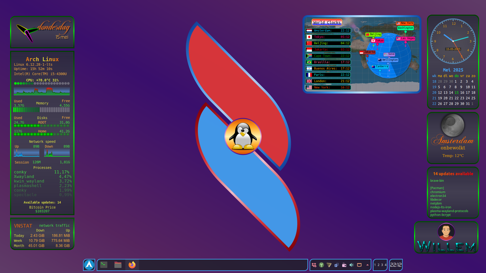

## Hi there 👋

# 👋 Welcome to my GitHub profile! 

Hi! I'm Willem. Welcome to my GitHub page. Here, I share projects, experiments, and code that I enjoy creating and maintaining.

## 🚀 About me

- 💻 Arch linux user, Plasma/KDE desktop
- 🛠️ Experienced with Conky and Lua.
- 📚 Always eager to learn and improve.

---

## 🧰 Technologies & Tools

---

## 📊 GitHub Readme Widgets

---

## 🎧 Now Playing on Spotify

---

## 📂 My repositories

Here you can find a selection of projects I've worked on or am currently working on. Feel free to browse around, leave a message, or submit a pull request if you’d like to contribute!

| Project                | Description                   |
|------------------------|------------------------------|
| [Conky System](https://wim66.github.io/conky-system-lua-V4/) | A collection of Conky configurations for system monitoring using Lua scripts |
| [Conky Weather & Forecast](https://github.com/wim66/Conky-Weather-and-forecast) | A lightweight and customizable weather widget for Conky |
| [Conky Digital Clocks](https://github.com/wim66/conky-digital-clocks) | A lightweight and customizable weather widget for Conky |
| [conky Analog Clocks](https://github.com/wim66/Conky-Lua-Clocks) | A collection of analog lua clocks |
| [All Reposetories](https://github.com/wim66?tab=repositories) | All public repositories |

---

Thanks for visiting my profile! ⭐

